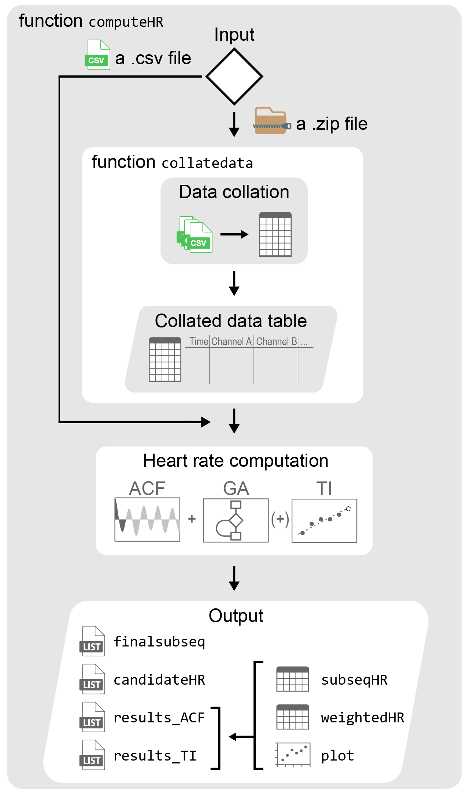

<!-- README.md is generated from README.Rmd. Please edit that file -->

```{r, include = FALSE}
knitr::opts_chunk$set(
  collapse = TRUE,
  comment = "#>",
  fig.path = "man/figures/README-",
  out.width = "100%"
)
```

# CardiacDP

CardiacDP (Cardiac Data Processing) can automatically read and collate heart rate data, and compute average heart rate per analysis interval (sequence). The analysis employs the autocorrelation function (ACF) with a genetic algorithm framework to identify periods of repeating waveforms within each sequence. These candidate heart rates of sub-sequences are then evaluated either by the autocorrelation value or a tracking index (TI), and finally weighted as the final output.

## Package structure

```{r, echo=FALSE, out.width = '100%'}

```

## Installation

```r
install.packages("CardiacDP")

# Or from GitHub
devtools::install_github("Vicellken/CardiacDP")

# Or the source package from GitHub:
# Vector of package names
packages <- c("data.table", "doParallel", "dplyr", "foreach", "ggplot2", "purrr", "RColorBrewer", "stringr")

lapply(packages, function(pkg) {
  if (!require(pkg, character.only = TRUE)) {
    install.packages(pkg)
  }
})

# Install the source package
install.packages("CardiacDP_0.4.1.tar.gz", repos = NULL, type = "source")
```

## Example

This is an example showing the complete analysis pipeline:

```{r example, eval=FALSE}
library(CardiacDP)

zip_path <- "~/rawfiles.zip" # PATH_TO_ZIP_FILE

# csv_path <- "" # PATH_TO_COLLATED_CSV

# run computeHR() for average heart rate analysis (no files are written by default)
output <- computeHR(
  file_path = csv_path, # collatedata() will automatically run if zip_path is directly provided here
  save_outputs = TRUE,
  output_dir = NULL, # PATH_TO_STORE_OUTPUTS
  verbose = TRUE)
```

The user can access the output by the channel name. finalsubseq is a list showing the positions and durations of the final periodic sub-sequences determined for each sequence. They are presented as data tables (s = start index of the sub-sequence; e = end index of the sub-sequence; p = which of the initial population the sub-sequence is derived from; and f = duration of the sub-sequence), the rows of which represent separate final sub-sequences.

```{r access output, results='hide'}
# positions (in indices) and durations of the final sub-sequences
# NOTE: the results are not included here for simplicity. For more details please refer to Supplementary Information S4 of the publication / User guideline.pdf

# output[["finalsubseq"]][["Channel A"]]
```

The corresponding candidate heart rates per sub-sequences can be found in candidateHR (ACF = autocorrelation value; lag = time lag; and hr = heart rate).

```{r access candidate heart rates, results='hide'}
# candidate heart rates of the final sub-sequences
# NOTE: the results are not included here for simplicity. For more details please refer to Supplementary Information S4 of the publication / User guideline.pdf

# output[["candidateHR"]][["Channel A"]]
```

The final results after evaluating the candidate heart rates, checking for resolution and weighting for durations can eventually be obtained from results_ACF and results_TI. These results referred to evaluating the candidate heart rates by merely autocorrelation values (i.e. the “ACF + GA” approach in the publication) or the tracking index (i.e. the “ACF + GA +TI” approach in the publication) respectively. Each of them consists of 1) the details of the sub-sequences (subseqHR); 2) the weighted heart rate per sequence (weightedHR); and 3) a plot of weighted heart rate against time (plot).

```{r final-results}
## results obtained from evaluating the candidate heart rates by autocorrelation values
# output[["results_ACF"]][["Channel A"]]

# results obtained from evaluating the candidate heart rates by the tracking index
# output[["results_TI"]][["Channel A"]]
```

## Interpret results

| Variable    | Content                                                                                                                                                                                                                                                                                                                                                                                                                                     |
| ----------- | ------------------------------------------------------------------------------------------------------------------------------------------------------------------------------------------------------------------------------------------------------------------------------------------------------------------------------------------------------------------------------------------------------------------------------------------- |
| finalsubseq | A list of positions and durations of the final periodic sub-sequences                                                                                                                                                                                                                                                                                                                                                                       |
| candidateHR | A list of candidate heart rates extracted from ACF for each sub-sequence                                                                                                                                                                                                                                                                                                                                                                    |
| results_ACF | Results obtained from evaluating the candidate heart rates of each sub-sequence based on autocorrelation values (i.e. following the "ACF + GA" approach as described in the main manuscript). Consisted of three items: 1) subseqHR: a list of sub-sequences and the corresponding heart rates and durations; 2) weightedHR: a list of final heart rates per sequence after weighing; and 3) plot: a plot of final heart rates against time |
| results_TI  | Results obtained from evaluating the candidate heart rates of each sub-sequence using a tracking index (i.e. following the "ACF + GA + TI" approach as described in the main manuscript). Consisted of three items: 1) subseqHR: a list of sub-sequences and the corresponding heart rates and durations; 2) weightedHR: a list of final heart rates per sequence after weighing; and 3) plot: a plot of final heart rates against time     |

## Automatically saved files

By default, `computeHR()` does **not** write any files. If you want CSV/PNG outputs, set `save_outputs = TRUE` and optionally provide `output_dir` (if `output_dir` is `NULL`, it defaults to `tempdir()`):

```{r save-outputs, eval=FALSE}
csv_path <- system.file("extdata", "example.csv", package = "CardiacDP")
output <- computeHR(
  file_path = csv_path,
  save_outputs = TRUE,
  output_dir = tempdir()
)
```

### CSV Files

For each channel and method (ACF and TI), the following CSV files are saved:

- `{Channel}_ACF_subseqHR.csv` - Details of sub-sequences with heart rates (ACF method)
- `{Channel}_ACF_weightedHR.csv` - Weighted heart rates per analysis interval (ACF method)
- `{Channel}_TI_subseqHR.csv` - Details of sub-sequences with heart rates (TI method)
- `{Channel}_TI_weightedHR.csv` - Weighted heart rates per analysis interval (TI method)

**Note:** Channel names with spaces (e.g., "Channel A") are converted to underscores (e.g., "Channel_A") in filenames.

### PNG Files

For each channel and method, heart rate plots are saved:

- `{Channel}_ACF_plot.png` - Heart rate plot (ACF method)
- `{Channel}_TI_plot.png` - Heart rate plot (TI method)

### Column descriptions

**weightedHR CSV files** contain:

- `ix` - Sequence index (1, 2, 3, ...)
- `Time_min` - Time in minutes (midpoint of analysis interval = (ix - 0.5) × analysis_interval)
- `wACF` - Weighted autocorrelation value
- `whr` - Weighted heart rate in beats per minute (can be NA)

**subseqHR CSV files** contain:

- `ix` - Sequence index
- `win` - Sub-sequence window number within the sequence
- `s`, `e`, `p`, `f` - Sub-sequence parameters (start, end, population, fitness)
- `ACF` - Autocorrelation value
- `lag` - Time lag
- `hr` - Heart rate in beats per minute (can be NA)
- `res` - Resolution used

## Reproducing plots from saved CSV files

The saved CSV files contain all the data needed to reproduce the heart rate plots. Use the **weightedHR** CSV files for plotting:

```{r reproduce plot, eval=FALSE}
library(ggplot2)
library(RColorBrewer)
library(data.table)

# Read the saved weighted heart rate data (example; assumes you ran computeHR(save_outputs=TRUE))
channel <- "Channel A"
data <- fread(paste0(gsub(" ","_",channel),"_TI_weightedHR.csv"))

# Create the plot (matching the package output)
palette <- brewer.pal(n = 11, name = "RdYlBu")
names(palette) <- seq(0, 10, 1) / 10

# analysis interval (by default 1 min)
an_in <- 1

ggplot() +
  geom_point(
    data = data,
    aes(x = ix * an_in, y = whr, fill = factor(floor(wACF * 10) / 10)),
    colour = "black", shape = 21, size = 4, alpha = 0.8
  ) +
  scale_fill_manual(
    name = "ACF", values = palette, na.value = NA,
    na.translate = FALSE, guide = "legend"
  ) +
  scale_y_continuous(
    name = "Heart rate (bpm)",
    breaks = seq(0, ceiling(max(data$whr, na.rm = TRUE) / 50) * 50, 50),
    limits = c(0, ceiling(max(data$whr, na.rm = TRUE) / 50) * 50),
    expand = c(0, 0)
  ) +
  scale_x_continuous(
    name = "Time (min)",
    breaks = seq(0, ceiling(max(data$Time_min, na.rm = TRUE) / 30) * 30, 30),
    limits = c(0, ceiling(max(data$Time_min, na.rm = TRUE) / 30) * 30),
    expand = c(0, 0)
  ) +
  theme_linedraw() +
  theme(
    text = element_text(size = 12, colour = "black"),
    panel.grid.minor = element_blank(),
    panel.border = element_rect(fill = NA, colour = "black", linewidth = 1)
  )
```

**Key columns for plotting:**

- **X-axis:** `ix * an_in` - Time in minutes
- **Y-axis:** `whr` - Weighted heart rate (bpm)
- **Fill color:** `wACF` - Weighted autocorrelation value (colored by discrete bins)
